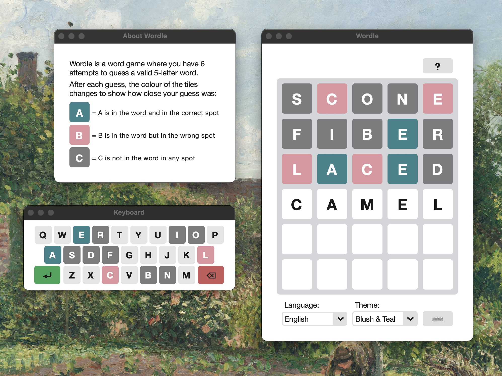

# Wordle - Multilingual Desktop Game

This is a Python desktop implementation of the popular word-guessing
game [Wordle](https://www.nytimes.com/games/wordle/index.html), built with `CustomTkinter`. Players have six attempts
to guess the 5-letter secret word, with color-coded feedback indicating correct, misplaced, or incorrect letters. The
game supports multiple languages (English, Norwegian, Ukrainian) and includes an optional on-screen keyboard to track
used letters and provide an alternative input method.

Players can choose from several themes, including classic, high-contrast and custom color schemes. Each day features a
deterministic *word of the day*, so everyone faces the same challenge. Pop-up messages guide users through invalid
guesses, repeated words, and game completion, ensuring a smooth, intuitive experience.

[Watch the 1-minute demo video](assets/demo.mp4) to see gameplay, theme, and language switching in action.
